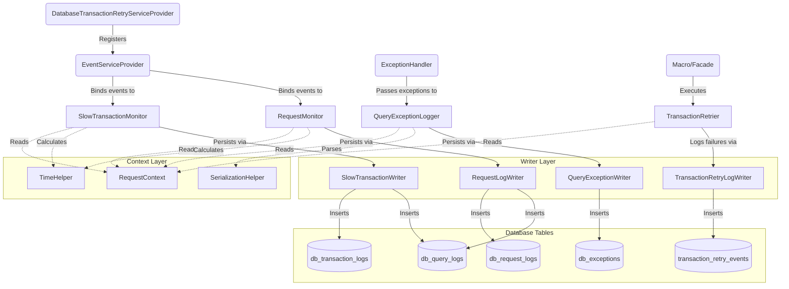

# Database Transaction Retry Architecture

## Visual Architecture Diagram
Here is a diagram illustrating the new architecture and data flow:

```mermaid
graph TD
    %% Core Triggers
    A(DatabaseTransactionRetryServiceProvider) -->|Registers| B(EventServiceProvider)
    B -->|Binds events to| C[SlowTransactionMonitor]
    B -->|Binds events to| D[RequestMonitor]
    E(ExceptionHandler) -->|Passes exceptions to| F[QueryExceptionLogger]
    G(Macro/Facade) -->|Executes| H[TransactionRetrier]

    %% Context Extraction Layer
    subgraph Context Layer
        Ctx[RequestContext]
        Time[TimeHelper]
        Ser[SerializationHelper]
    end

    C -.->|Reads| Ctx
    C -.->|Calculates| Time
    D -.->|Reads| Ctx
    D -.->|Calculates| Time
    F -.->|Reads| Ctx
    F -.->|Parses| Ser
    H -.->|Reads| Ctx

    %% Storage Writers
    subgraph Writer Layer
        STW[SlowTransactionWriter]
        RLW[RequestLogWriter]
        QEW[QueryExceptionWriter]
        TLW[TransactionRetryLogWriter]
    end

    C -->|Persists via| STW
    D -->|Persists via| RLW
    F -->|Persists via| QEW
    H -->|Logs failures via| TLW

    %% Database Targets
    subgraph Database Tables
        db_transaction_logs[(db_transaction_logs)]
        db_query_logs[(db_query_logs)]
        db_request_logs[(db_request_logs)]
        db_exceptions[(db_exceptions)]
        transaction_retry_events[(transaction_retry_events)]
    end

    STW -->|Inserts| db_transaction_logs
    STW -->|Inserts| db_query_logs
    RLW -->|Inserts| db_request_logs
    RLW -->|Inserts| db_query_logs
    QEW -->|Inserts| db_exceptions
    TLW -->|Inserts| transaction_retry_events
```
